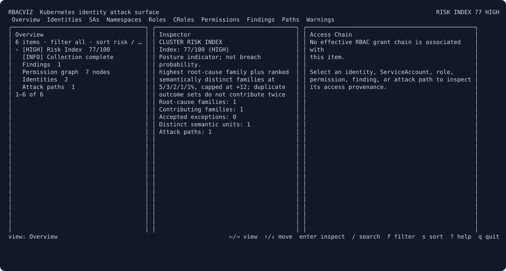
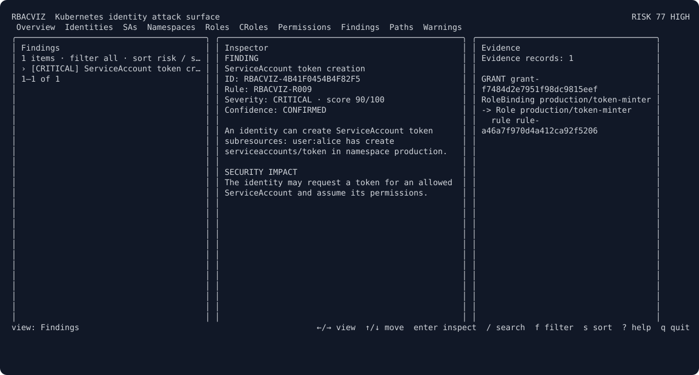

# rbacviz

> A terminal-first Kubernetes identity attack-path explorer.

`rbacviz` is a defensive, single-binary CLI for explaining effective Kubernetes
RBAC permissions, identity attack paths, observed mitigations, and the smallest
practical changes that can break dangerous paths.

The repository implements the complete **v0.2.0 source milestone set**. It
contains a Go 1.25 CLI that can collect live cluster metadata into a canonical,
credential-free snapshot and deterministically explain effective Kubernetes
RBAC permissions, inspect their typed graph, search bounded top-K paths, and
detect evidence-backed dangerous configurations and ranked privilege-escalation
paths, score paths, identities, namespaces, and the cluster, and investigate
the same immutable results in a responsive keyboard-first TUI from either a
live source or an offline snapshot. Two snapshots can be compared by security
meaning, proposed manifests can be measured entirely offline, and structured
remediation candidates can be virtually applied, impact-checked, Pareto
filtered, and ranked without applying them to a cluster.



## Product question

> What is the most dangerous identity path in this cluster, why does it exist,
> how certain are we that it is exploitable, and what smallest change breaks it?

## Product boundary

The current release:

- collect RBAC objects, workloads, asset metadata, and observable admission
  controls without reading Secret values;
- normalize live and offline input into the same deterministic snapshot model;
- calculate RBAC-derived effective permissions with grant provenance;
- detect and explain high-value dangerous permissions and multi-step paths;
- distinguish confirmed, likely, conditional, blocked, and unknown paths;
- score identities, namespaces, findings, paths, and the cluster transparently;
- support a terminal UI, JSON/SARIF output, snapshot diff, offline simulation,
  and advisory remediation.

The project does not execute attacks, modify clusters, fully interpret arbitrary
admission webhooks, or claim equivalence with the API server's complete
authorization decision.

## Installation

Install the latest Linux or macOS release to `~/.local/bin`:

```bash
curl -fsSL https://raw.githubusercontent.com/rbacviz/rbacviz/main/install.sh | sh
```

If `~/.local/bin` is not already in `PATH`:

```bash
export PATH="$HOME/.local/bin:$PATH"
rbacviz version
```

The installer detects `amd64` or `arm64`, downloads the matching archive from
GitHub Releases, verifies its SHA-256 checksum, and installs the binary
atomically. To install a specific release or choose another destination:

```bash
curl -fsSL https://raw.githubusercontent.com/rbacviz/rbacviz/main/install.sh | \
  sudo RBACVIZ_VERSION=v0.2.0 RBACVIZ_INSTALL_DIR=/usr/local/bin sh
```

Go developers can alternatively install directly from source:

```bash
go install github.com/rbacviz/rbacviz/cmd/rbacviz@latest
```

## Architecture documents

- [Architecture](docs/architecture/overview.md)
- [Domain and snapshot model](docs/architecture/domain-model.md)
- [Snapshot schema v1](docs/architecture/snapshot-schema.md)
- [Permission resolution](docs/architecture/permission-resolution.md)
- [Attack paths, risk, and remediation](docs/architecture/security-analysis.md)
- [Threat model](docs/security/threat-model.md)
- [Release and artifact verification](docs/release.md)
- [Changelog](CHANGELOG.md)
- [Measured benchmark baselines](docs/benchmarks.md)
- [CLI and TUI map](docs/architecture/interfaces.md)
- [Roadmap and technical risks](docs/architecture/roadmap.md)
- [Architecture decision records](docs/adr/)

## Build and use

Requirements: Go 1.25 or newer. Official release binaries are built with the
patched Go version recorded by `rbacviz version` and the release manifest.

```bash
go mod tidy
make build
./bin/rbacviz version
./bin/rbacviz config --show-sources
./bin/rbacviz snapshot save -o cluster.json --all-namespaces
./bin/rbacviz snapshot inspect cluster.json
./bin/rbacviz permissions user:alice --snapshot cluster.json
./bin/rbacviz who-can get pods --namespace production --snapshot cluster.json
./bin/rbacviz why-can serviceaccount:production:api patch deployments.apps --snapshot cluster.json
./bin/rbacviz graph stats --snapshot cluster.json
./bin/rbacviz graph nodes --type SERVICE_ACCOUNT --snapshot cluster.json
./bin/rbacviz findings --severity critical --snapshot cluster.json
./bin/rbacviz findings --snapshot cluster.json --output sarif
./bin/rbacviz attack-path --from user:alice --top 10 --snapshot cluster.json
./bin/rbacviz risk --snapshot cluster.json
./bin/rbacviz tui --snapshot cluster.json
./bin/rbacviz diff before.json after.json
./bin/rbacviz simulate -s cluster.json -f proposed-role.yaml
./bin/rbacviz remediate --snapshot cluster.json
./bin/rbacviz report --snapshot cluster.json --format md --file rbacviz-report.md
./bin/rbacviz report --snapshot cluster.json --format sarif --file rbacviz-report.sarif
./bin/rbacviz report --snapshot cluster.json --baseline examples/baseline-development.yaml
```

For a zero-cluster walkthrough, use the synthetic snapshots in
[`examples/clusters`](examples/clusters/README.md). They demonstrate a token
minter, an evaluated PSA-blocked host escape, and explicit partial collection.

Only implemented commands are registered. `snapshot save` uses the current
kubeconfig context and its default namespace unless `--namespace` or
`--all-namespaces` is supplied. `snapshot inspect` performs no cluster calls.

### Effective permission queries

Permission commands accept a live cluster by default or `--snapshot <file>`
for fully offline analysis:

```bash
# Every normalized capability and every independent grant path.
rbacviz permissions user:alice --snapshot cluster.json

# Group membership is never inferred; provide it explicitly for a User query.
rbacviz permissions user:alice --as-group developers --as-group on-call

# Resource syntax: resource, resource.group, or resource.group/subresource.
rbacviz who-can get pods --namespace production
rbacviz who-can update deployments.apps/status --namespace production
rbacviz why-can serviceaccount:production:api get pods/log --namespace production

# A leading slash is treated as a non-resource URL.
rbacviz who-can get /healthz

# Machine-readable results use the versioned permission result schema.
rbacviz why-can user:alice get secrets --namespace production --output json
```

Identity syntax is `user:<name>`, `group:<name>`, or
`serviceaccount:<namespace>:<name>` (the short `sa:` prefix is also accepted).
`why-can` returns every matching grant, not just the first, so redundant
bindings remain visible for later remediation analysis. A `RoleBinding` is
always namespaced even when it references a `ClusterRole`; a
`ClusterRoleBinding` follows the discovered resource scope. Missing discovery
data remains matchable as `Unknown` scope and is surfaced as a warning.

Aggregated ClusterRoles are recomputed from their selectors. The resolver does
not trust potentially stale materialized rules in the snapshot, preserves each
aggregation provenance chain, and reports cycles without looping.

### Typed graph and path queries

The graph is a directed multigraph with stable portable node/edge IDs, compact
internal indexes, typed relations, and mandatory evidence on every edge. It
contains identities, bindings, roles, effective capabilities, lazy resource
selectors, workloads, ServiceAccounts, assets, namespaces, and observed
security controls.

```bash
# Inventory by node type and edge relation.
rbacviz graph stats --snapshot cluster.json

# Discover stable IDs and copyable portable keys.
rbacviz graph nodes --type IDENTITY --type SERVICE_ACCOUNT --snapshot cluster.json
rbacviz graph nodes --type RESOURCE_SELECTOR --name secrets --node-namespace production --snapshot cluster.json

# Either a stable node ID or an exact key can be used as an endpoint.
rbacviz graph paths \
  --from identity:serviceaccount:production:api \
  --to '<resource-selector-key-from-graph-nodes>' \
  --k 5 --max-depth 12 --max-expanded 50000 \
  --snapshot cluster.json
```

Path search uses non-negative edge weights, rejects cycles within each
candidate, and orders results by total cost, length, then stable path identity.
`--max-depth` and `--max-expanded` are hard safety limits; a bounded result
reports `truncated: true` instead of pretending it exhaustively searched the
graph. RBAC resources remain lazy selectors and are not multiplied by every
discovered object. `graph paths` still describes structural/permission
reachability; use `attack-path` when a security template, prerequisites,
controls, and exploitability confidence are required.

### Security findings

The Milestone 5 rule engine resolves permissions once, then evaluates 32 small,
independently testable rules with stable IDs. Initial coverage includes direct
`cluster-admin` and `system:masters` bindings, wildcards, Secret and token
access, workload mutation, exec/attach/port-forward, proxy access,
impersonation, RBAC `bind`/`escalate`, CSR approval, admission webhook mutation,
and directly observed privileged workload settings.

```bash
# Human summary, optionally filtered by severity, rule, or namespace.
rbacviz findings --snapshot cluster.json
rbacviz findings --severity critical --namespace production --snapshot cluster.json
rbacviz findings --rule RBACVIZ-R009 --snapshot cluster.json

# Versioned machine output and CI/code-scanning output.
rbacviz findings --snapshot cluster.json --output json
rbacviz findings --snapshot cluster.json --output sarif > rbacviz.sarif

# Re-run deterministic analysis and inspect one stable finding ID.
rbacviz explain RBACVIZ-0123456789ABCDEF --snapshot cluster.json
```

Every finding contains its rule and stable finding ID, severity, initial static
risk score, confidence, affected identities and objects, exact grant or object
field evidence, preconditions, observed mitigations, attack-path references,
recommendations, and documentation references. Empty attack paths and
mitigating controls remain explicit in the findings contract; the separate
attack-path result supplies ranked technique chains and control observations.
A present finding remains evidence-backed
when collection is partial, while result completeness and warnings prevent an
incomplete scan from being mistaken for an all-clear result.

### Attack paths

The Milestone 6 engine ships template set `1.0.0` with 12 attack techniques:
direct `cluster-admin`, `system:masters`, ServiceAccount token minting, workload
identity takeover, Secret-to-identity inference, RBAC `bind` and `escalate`,
binding mutation, impersonation, node proxy, CSR approval, and privileged
workload host escape.

```bash
# Rank paths from one observed identity.
rbacviz attack-path --from user:alice --snapshot cluster.json

# Select a typed privilege target and namespace, then bound the work and output.
rbacviz attack-path \
  --from serviceaccount:production:api \
  --to service-account-takeover \
  --namespace production \
  --top 10 --max-expanded 50000 \
  --snapshot cluster.json

# Versioned deterministic machine output.
rbacviz attack-path --to host-escape --snapshot cluster.json --output json
```

Every path exposes its source, typed privilege target, ordered steps, normalized
permission, exact RBAC grant and original rule, binding and role references,
scope, prerequisites, mitigation observations, confidence reasons, additive
cost breakdown, and advisory remediation candidates. Ranking uses blocked
state, total technique cost, privilege gain, blast radius, confidence, and a
stable path ID as a total order.

`CONFIRMED`, `LIKELY`, `CONDITIONAL`, `BLOCKED`, and `UNKNOWN` are categorical
evidence states, not probabilities. Enforced Pod Security Admission at
`baseline` or `restricted` can produce a semantically evaluated blocked host
escape path. Uninterpreted admission webhooks, ValidatingAdmissionPolicy,
Kyverno, and Gatekeeper metadata are only potential mitigations and lower
confidence to `UNKNOWN`. Secret values are never inspected, so useful
credential material remains an explicit prerequisite rather than a claim.

### Transparent risk

Risk model `2.0.0` preserves the calibrated path calculation and scores each
bounded attack path with six normalized factors:
impact (30%), exploitability (22%), blast radius (18%), exposure (10%), path
quality (10%), and confidence (10%). The result includes every raw value,
integer weight, weighted contribution, scope factor, mitigation deduction, and
the exact numerator and denominator used for the single final rounding step.

```bash
# Full cluster report with the top human-readable explanations.
rbacviz risk --snapshot cluster.json --top 10

# Scope the complete calculation to one identity or namespace.
rbacviz risk --identity serviceaccount:production:api --snapshot cluster.json
rbacviz risk --namespace production --snapshot cluster.json

# Versioned JSON; optionally embed the complete attack-path evidence.
rbacviz risk --snapshot cluster.json --output json
rbacviz risk --snapshot cluster.json --output json --include-paths

# Reproducible offline example included in this repository.
rbacviz risk --snapshot examples/risk-token-minter.json
```

Scores use fixed integer arithmetic. Cluster-wide targets receive a `1.15`
scope multiplier; namespace and identity-local targets use documented factors
from `0.85` to `1.00`. A semantically evaluated blocking control applies a 90%
deduction while retaining the underlying impact factor. Uninterpreted potential
controls apply a conservative 10% deduction each, capped at 30%, and remain
visible as uncertainty rather than proof of blocking.

Identity, namespace, and cluster scores are not sums. Risk model `2.0.0`
groups derivative paths by the exact binding/subject root cause, so a wildcard
grant remains one risk family even when it produces many techniques and
targets. The highest family is primary; at most five semantically distinct
families add ranked `5/3/2/1/1%` contributions, capped at `+12`. Redundant
families with the same complete semantic outcome set remain visible but do not
contribute twice. JSON retains every family, path ID, selected contributor,
weight, and exact integer contribution. The result is a posture index, not
breach probability.

### Semantic diff and offline simulation

Milestone 9 compares the derived security meaning of two canonical snapshots,
not only their serialized objects:

```bash
# Human security-impact summary.
rbacviz diff before.json after.json

# Versioned machine-readable result with bounded path analysis.
rbacviz diff before.json after.json --output json \
  --max-paths 10000 --max-expanded 100000

# Apply one file or every supported manifest in a directory to an in-memory copy.
rbacviz simulate -s cluster.json -f proposed-role.yaml
rbacviz simulate -s cluster.json -f manifests/ --output json

# Reproducible offline example included in this repository.
rbacviz simulate -s examples/simulation-base.json \
  -f examples/simulate-token-minter.yaml
```

The result separates added/removed effective capabilities from provenance-only
grant changes, then reports newly dangerous wildcard, Secret, workload-mutation,
token, impersonation, and RBAC-control access. It also compares findings,
semantic attack paths, path confidence/blocking state, observed controls, and
cluster/namespace/identity risk. Parallel grants for the same capability and
semantic path remain visible as evidence without being counted as new access.

Simulation accepts `Role`, `ClusterRole`, their bindings, ServiceAccounts,
supported workloads and metadata assets, Namespace PSA labels, admission
objects, Kyverno, and Gatekeeper metadata. A manifest fully replaces the
security-relevant representation of an object. To simulate deletion, add:

```yaml
metadata:
  annotations:
    rbacviz.io/simulate-operation: delete
```

Files are processed in argument order; directory contents are processed by
stable path order. Namespaced manifests without `metadata.namespace` use the
selected namespace, snapshot namespace, then `default`. Unsupported kinds are
rejected rather than silently ignored. Secret `data` and `stringData` are
discarded during conversion and never enter the snapshot or result.

`simulate` requires `--snapshot`/`-s`; it has no live-cluster fallback and no
code path that applies manifests.

### Simulated remediation

Remediation model `1.0.0` generates structured cut-point candidates from the
bounded attack-path evidence, deep-clones the canonical snapshot, virtually
applies each candidate, and runs the complete semantic diff again:

```bash
# Rank the smallest measurable security improvements.
rbacviz remediate --snapshot cluster.json --top 10

# Scope candidate generation and retain full dominated-candidate evidence.
rbacviz remediate \
  --identity serviceaccount:production:api \
  --namespace production \
  --include-dominated \
  --include-diff \
  --snapshot cluster.json

# Deterministic machine-readable result.
rbacviz remediate --snapshot examples/risk-token-minter.json --output json
```

The first candidate set supports removing one exact subject grant, narrowing
one exact source rule verb, and enforcing supported `restricted` Pod Security
Admission metadata for a host-escape path. Every evaluated candidate reports
removed or blocked attack paths, remaining paths, lost effective capabilities,
affected identities, redundant-grant changes, and exact cluster, namespace,
and identity risk deltas.

Security benefit uses explicit weights for removed critical/high/medium paths,
newly blocked paths, and risk reduction. Operational cost exposes permission
loss, affected identities, edit complexity, and uncertainty. Candidates are
Pareto-filtered before deterministic benefit/cost ranking. A binding edit that
only removes one redundant grant is marked `INEFFECTIVE`, not recommended.
Incomplete or truncated source analysis remains visible and adds an uncertainty
penalty.

The engine is advisory-only: it has no Kubernetes client, patch, apply, or
write interface. The operator remains responsible for reviewing and applying
any change outside `rbacviz`.

### Root-cause security reports

The first v0.2 report model correlates raw findings, attack paths, risk scores,
and virtually evaluated remediation candidates into a prioritized list of
root causes. Correlated signals keep all original IDs and evidence, but one
binding/subject grant is not presented as dozens of independent problems.

```bash
# Portable report for review by platform and development teams.
rbacviz report \
  --snapshot cluster.json \
  --format md \
  --file rbacviz-report.md

# Versioned machine-readable report contract.
rbacviz report --snapshot cluster.json --format json --file rbacviz-report.json

# Root-cause SARIF 2.1.0 for CI and code-scanning consumers.
rbacviz report --snapshot cluster.json --format sarif --file rbacviz-report.sarif

# Namespace-scoped report with explicit analysis bounds.
rbacviz report --snapshot cluster.json --namespace production \
  --max-issues 100 --max-candidates 50 \
  --max-paths 10000 --max-expanded 100000
```

The report separates severity, confidence, actionability, priority, and the
posture-oriented Risk Index. `ACTIONABLE`, `CONDITIONAL`, `BLOCKED`, and
`OBSERVATION` are not probabilities. Each listed fix comes from the existing
offline remediation engine and includes measured before/after risk, removed or
blocked paths, permission loss, affected identities, and verification commands.
If no measured candidate exists, the report says so rather than inventing an
unsafe patch. Markdown, JSON, and SARIF are generated from the same versioned
model; none contains ANSI terminal decoration. Each detailed root cause also
contains an evidence-backed Access Chain: workload/identity → binding → role →
effective permissions, with RoleBinding and ClusterRoleBinding scope kept
distinct.

SARIF emits one result per root cause, stable issue/root-cause fingerprints,
Kubernetes object URIs, and analysis warnings as tool notifications. A fully
accepted baseline entry remains present with an external accepted suppression.
A rule-only exception that accepts only part of a grouped issue is retained as
audit metadata and never suppresses the complete SARIF result.

### Interactive terminal UI

Milestone 8 adds a full-screen Bubble Tea interface backed by the same snapshot,
graph, findings, attack-path, and risk application services as the CLI:

```bash
# Offline investigation is reproducible and makes no Kubernetes API calls.
rbacviz tui --snapshot cluster.json

# Live collection uses the same global kubeconfig/context/namespace flags.
rbacviz tui --context production --all-namespaces

# Useful for terminal recording, debugging, and environments without alt-screen.
rbacviz tui --snapshot cluster.json --no-alt-screen
```

Implemented views are Overview, Identities, ServiceAccounts, Namespaces, Roles,
ClusterRoles, Permissions, Findings, Attack Paths, and Collection Warnings.
Search (`/`), screen-specific filters (`f`), deterministic sorting (`s`),
inspectors and evidence preserve their state per view. Pressing `r` opens a
lazy, independently cancellable remediation simulation panel backed by the
same engine as `rbacviz remediate`.
The central keymap also provides `↑/↓`, `Enter`, `Esc`, `Tab`/`Shift+Tab`, `e`,
`p`, `r`, `?`, and `q`.

The responsive layout exposes List, Inspector, Access Chain, and Evidence. Below
80 columns one panel is shown at a time; 80–119 shows the list plus the selected
Inspector/Access detail; 120–159 shows List + Inspector + Access Chain; and 160+
shows all four columns. Access Chain visualizes workload/identity → binding →
role → effective permissions and adds priority, status, confidence, root cause,
impact, recommendation, and a verification command from one shared explanation
model. Long inventories render only the visible window. Initial collection and
analysis are staged and cancellable; detailed attack-path evidence is
materialized only when the Attack Paths view is requested and can be cancelled
independently. Partial collection and bounded-analysis warnings remain
persistently visible.



### Snapshot safety and completeness

The collector reads RBAC, ServiceAccounts, workload security metadata, API
discovery, security-relevant asset metadata, Pod Security Admission labels,
admission policies, admission webhooks, and detectable Kyverno/Gatekeeper
resource metadata. Secret objects are requested through Kubernetes' metadata
API; Secret payloads are never requested or represented by the schema. Because
the metadata API does not expose a Secret's `type`, that optional field remains
empty rather than fetching the full Secret object.

Independent API failures become deterministic `collectionWarnings`. A partial
snapshot is saved by default so it can still be inspected. Use `--strict` to
reject partial collection with exit code 3:

```bash
rbacviz snapshot save -o cluster.json --strict
```

Snapshot files are written atomically with owner-only permissions. The loader
rejects incompatible schema majors and sensitive JSON fields such as `data`,
`stringData`, bearer tokens, and private-key material.

### Configuration precedence

Configuration is merged deterministically in this order:

```text
defaults < config file < RBACVIZ_* environment variables < explicit flags
```

The default file is the operating system user config directory followed by
`rbacviz/config.json`. Select another file with `--config` or
`RBACVIZ_CONFIG`. Unknown JSON fields and invalid values are rejected.

Example:

```json
{
  "namespace": "production",
  "output": "human",
  "noColor": false,
  "timeout": "30s",
  "logLevel": "info"
}
```

Supported environment variables are `RBACVIZ_CONTEXT`,
`RBACVIZ_KUBECONFIG`, `RBACVIZ_NAMESPACE`, `RBACVIZ_ALL_NAMESPACES`,
`RBACVIZ_SNAPSHOT`, `RBACVIZ_OUTPUT`, `RBACVIZ_NO_COLOR`,
`RBACVIZ_TIMEOUT`, and `RBACVIZ_LOG_LEVEL`.

### Exit codes

| Code | Meaning |
| ---: | --- |
| 0 | success |
| 1 | operational or configuration validation failure |
| 2 | invalid command, arguments, or flags |
| 3 | partial collection rejected by strict completeness mode |
| 4 | configured security gate reached |

## Implemented milestone sequence

Milestones are deliberately ordered so that every layer can be tested through
stable domain contracts before the interactive UI depends on it:

1. foundation and CLI shell (completed);
2. snapshot schema and collection (completed);
3. permission resolver (completed);
4. typed graph and pathfinding (completed);
5. findings and JSON/SARIF (completed);
6. attack templates, privilege targets, confidence, and mitigations (completed);
7. transparent risk scoring (completed);
8. interactive TUI (completed);
9. semantic diff and offline simulation (completed);
10. remediation candidates and impact ranking (completed);
11. release hardening (completed);
12. v0.2 root-cause Markdown/JSON reports (completed);
13. shared access explanations and responsive Access Chain panel (completed);
14. root-cause-family Risk Index `2.0.0` (completed);
15. reviewed baselines and suppressions (completed);
16. root-cause SARIF 2.1.0 mapping (completed).

The detailed plan is in [roadmap.md](docs/architecture/roadmap.md).
