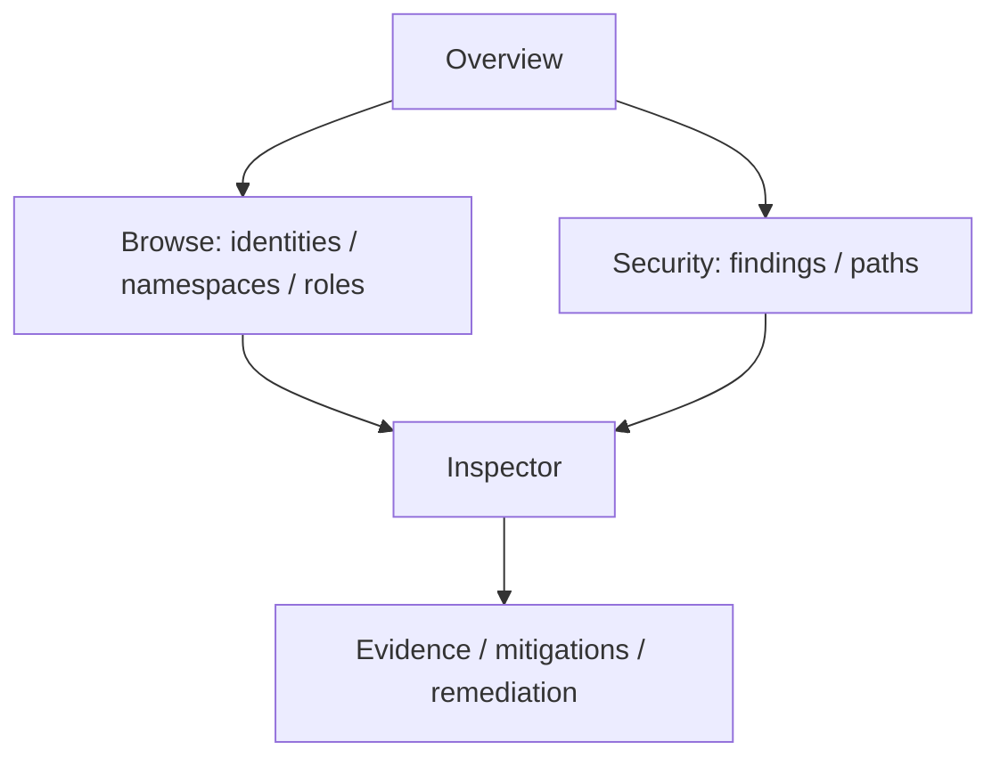

# CLI hierarchy and TUI navigation

## CLI command tree

Global flags are parsed once and passed as immutable options:
`--context`, `--kubeconfig`, `--namespace`, `--all-namespaces`, `--snapshot`,
`--output`, `--no-color`, `--timeout`, and `--log-level`.

```text
rbacviz
├── version
├── scan
├── tui
├── permissions <identity>
├── who-can <verb> <resource>
├── why-can <identity> <verb> <resource>
├── graph
│   ├── stats
│   ├── nodes
│   └── paths --from <node> --to <node>
├── findings
├── explain <finding-id>
├── attack-path
├── risk
├── snapshot
│   ├── save
│   └── inspect <file>
├── diff <before> <after>
├── simulate --snapshot <file> --file <path>
├── remediate
├── export
│   ├── json
│   ├── sarif
│   ├── markdown
│   ├── mermaid
│   └── graphviz
└── scanner-rbac
```

`scanner-rbac` prints a recommended read-only manifest and explanation; it
never applies it. Commands requiring analysis accept either a live source or
`--snapshot`, but not conflicting sources. `--output` selects human, JSON,
SARIF, or Markdown where supported.

Exit-code proposal:

| Code | Meaning |
| ---: | --- |
| 0 | successful command, including findings below configured gate |
| 1 | operational or validation failure |
| 2 | invalid command/flags |
| 3 | collection completed partially and strict completeness was requested |
| 4 | configured security threshold was met/exceeded |

Machine output sends diagnostics to stderr and never includes ANSI decoration.

## TUI screen map



Milestone 8 implemented tabs:

1. Overview
2. Identities
3. ServiceAccounts
4. Namespaces
5. Roles
6. ClusterRoles
7. Permissions
8. Findings
9. Attack Paths
10. Collection Warnings

Semantic diff and operator-supplied manifest simulation are available through
the Milestone 9 CLI application services. Milestone 10 adds a lazy remediation
panel: `r` runs the same isolated candidate simulation and ranking service as
the CLI, can be cancelled independently, and never applies a change. Existing
finding/path advice remains available while the measured result loads.

The screen stack preserves filters and selection when entering an inspector
and returning. Detailed attack-path materialization is requested lazily through
the shared application query and remains bounded and cancellable.

## Navigation contract

| Key | Action |
| --- | --- |
| `↑` / `↓` | move selection |
| `Enter` | inspect |
| `Esc` | back |
| `/` | search |
| `f` | filter |
| `s` | sort |
| `Tab` / `Shift+Tab` | next/previous panel |
| `e` | evidence |
| `p` | attack paths |
| `r` | remediation |
| `?` | contextual help |
| `q` | quit or close modal according to stack |

Bindings live in one keymap package and are not duplicated in screen code.

## Responsive behavior

- Under 80 columns: one panel, compact labels, vertical path view.
- 80–119 columns: list plus inspector when useful.
- 120+ columns: list, inspector, and evidence panels.
- Long lists render only a virtualized visible window; inspectors and evidence
  use Bubbles viewports.
- Collection and analysis emit progress events; cancellation is always visible.
- Partial results display a persistent incompleteness indicator.

The TUI consumes the same immutable `AnalysisResult` and query services as the
CLI. It does not contain alternate permission or scoring logic.
