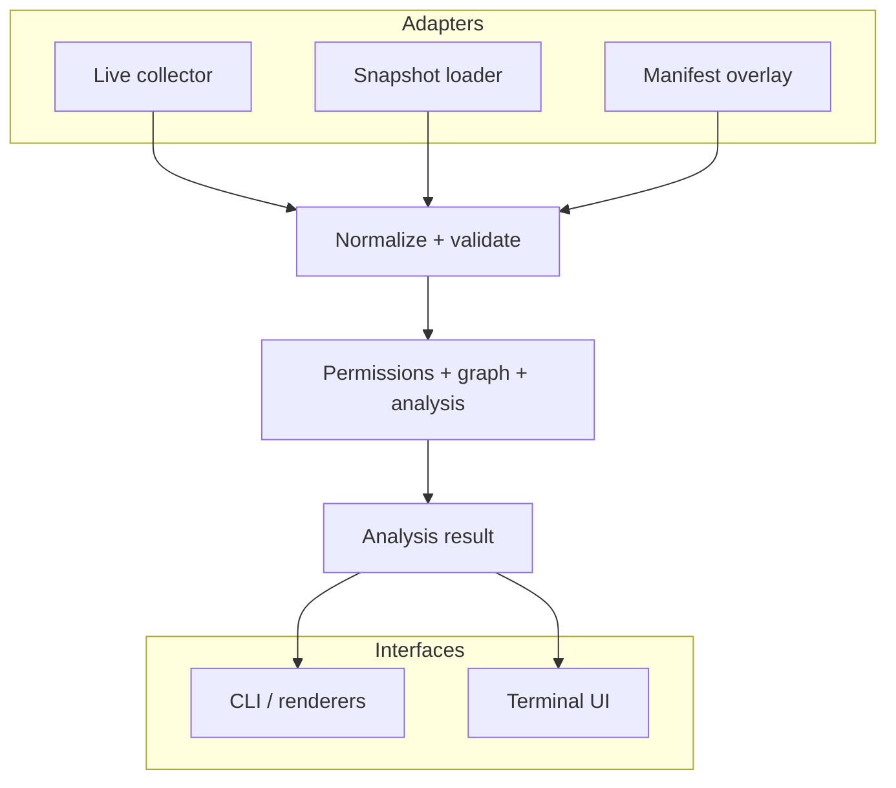
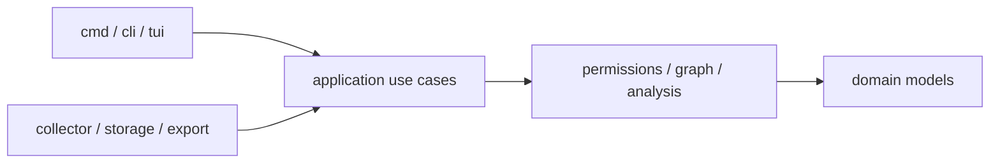

# Architecture overview

## Refined scope

`rbacviz` is an offline-capable Kubernetes identity security analyzer. It
collects only the metadata needed to calculate RBAC-derived permissions and
security relationships. It turns those inputs into explainable findings and
ranked attack paths, then presents the same analysis through CLI, structured
output, and a terminal UI.

The MVP prioritizes correctness and evidence for these questions:

1. Which permissions does an identity receive and from which exact rules and
   bindings?
2. Which permissions form a plausible path to a typed privilege target?
3. Which observed controls block or weaken that path?
4. Which virtual change removes the most dangerous paths with the least
   estimated permission loss?

Cloud IAM correlation, arbitrary policy interpretation, audit-log identity
mining, and continuous in-cluster operation are post-MVP concerns.

## Architectural style

The application is a modular monolith compiled into one binary. Domain and
analysis packages contain no Cobra, Bubble Tea, filesystem, or Kubernetes
client types. Adapters translate external input into versioned domain models.



## Dependency direction

Dependencies point inward. Interfaces and adapters may depend on application
use cases; use cases depend on domain contracts and pure analysis packages.
The domain does not depend on infrastructure.



Forbidden dependency examples:

- `models` importing `client-go`;
- `permissions` importing Cobra or renderers;
- rules writing directly to stdout;
- TUI starting collection without an application use case;
- snapshot parsing silently invoking live Kubernetes APIs.

## Planned package responsibilities

| Package | Responsibility | Must not own |
| --- | --- | --- |
| `cmd/rbacviz` | process entry point | business logic |
| `internal/cli` | Cobra commands, flags, exit-code mapping | analysis algorithms |
| `internal/app` | orchestration use cases and progress events | Kubernetes type semantics |
| `internal/config` | explicit config merge and validation | mutable global config |
| `internal/domain` | stable typed models and invariants | I/O or framework types |
| `internal/collector` | live discovery and metadata collection | findings or scoring |
| `internal/snapshot` | schema, canonicalization, validation, load/save | live network calls |
| `internal/diff` | canonical and derived security comparison | cluster mutation or output formatting |
| `internal/permissions` | aggregation, binding resolution, matching, evidence | output formatting |
| `internal/graph` | typed multigraph, indexes, queries, weighted traversal | rule-specific policy |
| `internal/analysis` | findings, templates, admission observations, blast radius | TUI state |
| `internal/risk` | deterministic factor scoring and explanations | hidden heuristics |
| `internal/remediation` | virtual candidates, impact, ranking | cluster mutation |
| `internal/simulate` | bounded manifest parsing, snapshot overlay, what-if comparison | applying manifests or live fallback |
| `internal/baseline` | strict reviewed exceptions, expiry, exact signal matching | deleting findings or changing raw path scores |
| `internal/report` | root-cause correlation, priority, versioned Markdown/JSON document model | new security findings or unmeasured fixes |
| `internal/renderer` | text, JSON, SARIF, Markdown | analysis decisions |
| `internal/tui` | interactive presentation and navigation | collection internals |
| `pkg/api` | intentionally supported external result/schema types | unstable internals |

Packages are created only when they contain cohesive behavior. Early
milestones may keep related code together instead of creating empty directory
scaffolding.

## Application use cases

The initial orchestration surface is intentionally small:

```go
type SnapshotSource interface {
    Load(ctx context.Context) (Snapshot, []CollectionWarning, error)
}

type Analyzer interface {
    Analyze(ctx context.Context, snapshot Snapshot, options AnalysisOptions) (AnalysisResult, error)
}

type Simulator interface {
    Simulate(ctx context.Context, base Snapshot, manifests []Manifest) (SimulationResult, error)
}
```

These are illustrative contracts, not production code. Concrete interfaces
will live beside their consumers to avoid a central abstraction package.

## Determinism contract

For an identical canonical snapshot, ruleset version, and analysis options:

- stable IDs are identical;
- normalized capabilities sort identically;
- findings and paths are produced in a documented total order;
- scores and explanations are identical;
- wall-clock timestamps do not influence analysis;
- map iteration order and collection concurrency cannot influence output.

Collection time remains snapshot metadata and is excluded from semantic IDs.

## Concurrency and cancellation

Only I/O-heavy collection uses bounded concurrency. Normalization and analysis
begin deterministic and single-process; parallelism may be added behind stable
sorting barriers after benchmarks justify it. Every public use case accepts a
`context.Context`. Cancellation returns an explicit partial/incomplete status,
never an apparently complete result.
