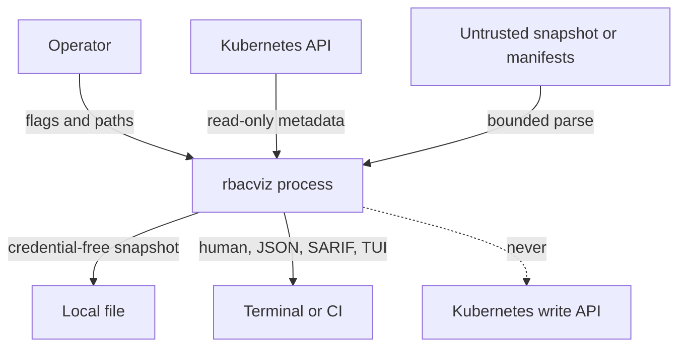

# Threat model

This document defines the security boundary of `rbacviz` release `v0.2.x`.
It is deliberately narrower than a penetration-testing tool: `rbacviz` explains
observed authorization state and models possible paths, but never executes one.

## Assets to protect

- Kubernetes API credentials available to `client-go` while collecting metadata;
- cluster topology, workload names, image names, RBAC subjects, and other
  sensitive metadata contained in snapshots and reports;
- terminal and CI output, which may be retained in logs;
- integrity of release binaries, checksums, SBOM, and analysis results;
- operator trust in completeness, confidence, and risk conclusions.

Secret values, ServiceAccount tokens, kubeconfig contents, private keys, and
admission-policy source are not analysis inputs and must never enter a snapshot.

## Trust boundaries and data flow



The local process is trusted to enforce the boundary. Kubernetes responses,
snapshot files, manifests, object names, labels, annotations, and terminal
dimensions are untrusted. Output destinations and their access controls are the
operator's responsibility.

## Security objectives

1. Collection is metadata-only and uses no create, update, patch, delete,
   exec, attach, proxy, token request, impersonation, or SubjectAccessReview
   operation.
2. Offline commands have no live fallback. `diff`, `simulate`, and `remediate`
   cannot construct a cluster-writing client.
3. A snapshot cannot represent Secret payloads. The decoder rejects forbidden
   sensitive field names recursively; manifest conversion discards Secret
   `data` and `stringData`.
4. All conclusions retain exact evidence and explicit completeness. Collection
   failures lower completeness and confidence instead of implying absence.
5. Expensive graph and attack-path work is bounded, cancellable, and reports
   truncation.
6. Stable IDs, sorting, integer scoring, and normalized archives prevent input
   order, timestamps, map iteration, and duplicate grants from silently changing
   results.
7. Release consumers can verify SHA-256 checksums and inspect a CycloneDX SBOM.

## Threats and controls

| Threat | Control | Residual risk |
| --- | --- | --- |
| Credential or Secret leakage | schema has no payload field; recursive forbidden-key rejection; metadata-only collectors; negative tests | object names, Secret type, image names, and RBAC metadata may still be sensitive |
| Unexpected cluster mutation | collector exposes read/list/watch-style acquisition only; offline simulation mutates deep in-memory clones; no apply command | Kubernetes audit logs should still be used to verify deployment-specific behavior |
| Malicious snapshot exhausts resources | 256 MiB snapshot limit, canonical validation, bounded path expansion, context cancellation, virtualized TUI | a valid near-limit snapshot can still consume substantial memory during full analysis |
| Crafted terminal text performs control-sequence injection | canonical domain output is formatted by the application; release screenshots use no-color output and XML escaping | Kubernetes object names may contain unusual printable Unicode and confuse visual review |
| Incomplete discovery creates a false all-clear | warnings, `complete=false`, strict partial exit code, confidence propagation, persistent TUI banner | an operator may ignore warnings or remove them from downstream JSON processing |
| Unknown webhook/policy behavior is treated as proof | unknown semantics are potential mitigations only and lower confidence | actual admission behavior can differ from metadata-only observation |
| Duplicate grants inflate risk | semantic capability/path deduplication while retaining every provenance path | distinct but operationally equivalent policies can still require human interpretation |
| Remediation breaks workloads | advisory-only virtual simulation, lost-permission inventory, affected identities, Pareto ranking | authorization use is not inferred from audit logs, so operational cost is incomplete |
| Tampered release artifact | deterministic archives, SHA-256 file, release manifest, SBOM, CI provenance attestation | checksums are useful only when obtained from a trusted release channel |
| Compromised dependency or build action | minimal GitHub permissions, pinned tool versions, dependency review, `govulncheck`, SBOM | vulnerability databases and action tags are external trust dependencies |

## Abuse cases explicitly out of scope

The project must not add:

- exploit execution or automatic privilege escalation;
- shell, exec, attach, port-forward, node proxy, or token-minting clients;
- Secret or token retrieval, decoding, export, or validation;
- malicious manifest generation or automatic `kubectl apply`;
- credential reuse against Kubernetes or external systems;
- continuous monitoring, daemon behavior, or hidden network telemetry.

Attack-path steps are typed explanations only. Example manifests contain no
payload that grants access outside their synthetic offline snapshots.

## Privacy and retention

Snapshots are created with owner-only file permissions, but reports redirected
by a shell inherit that shell's umask. Treat snapshots, SARIF, JSON, screenshots,
and support bundles as confidential cluster metadata. Use synthetic examples in
issues. Never attach a real kubeconfig or production snapshot to a report.

## Verification checklist

Before a release:

```bash
make verify
make lint
make vuln
make screenshots
make verify-reproducible VERSION=v0.2.0 COMMIT=<commit> SOURCE_DATE_EPOCH=<epoch>
```

Review changes touching `internal/collector`, `internal/snapshot`,
`internal/simulate`, `internal/remediation`, CLI command registration, archive
generation, or GitHub workflow permissions as security-sensitive.

Baseline files are also security-sensitive policy input. The loader rejects
unknown fields, wildcard selectors, incomplete review metadata, invalid
identity/binding scope, and incompatible schemas. Expired entries fail safe and
unmatched entries remain visible. Accepted entries never delete raw findings,
paths, or evidence; they affect only the separately labeled active posture
rollup.
Suppressing one rule never suppresses its entire root-cause family; changing
the posture rollup requires an explicit `riskFamilyId` or `rootCauseKey`.

## Known limitations

- RBAC is not the whole Kubernetes authorization decision. Node, webhook, cloud
  IAM, external identity-provider groups, and runtime state may add or remove access.
- Arbitrary admission policy code is not interpreted.
- Secret metadata cannot prove that useful credentials exist.
- Remediation cost covers modeled permission loss, not actual workload usage.
- Benchmarks are engineering baselines, not a supported maximum cluster-size claim.

Report security defects according to [SECURITY.md](../../SECURITY.md).
